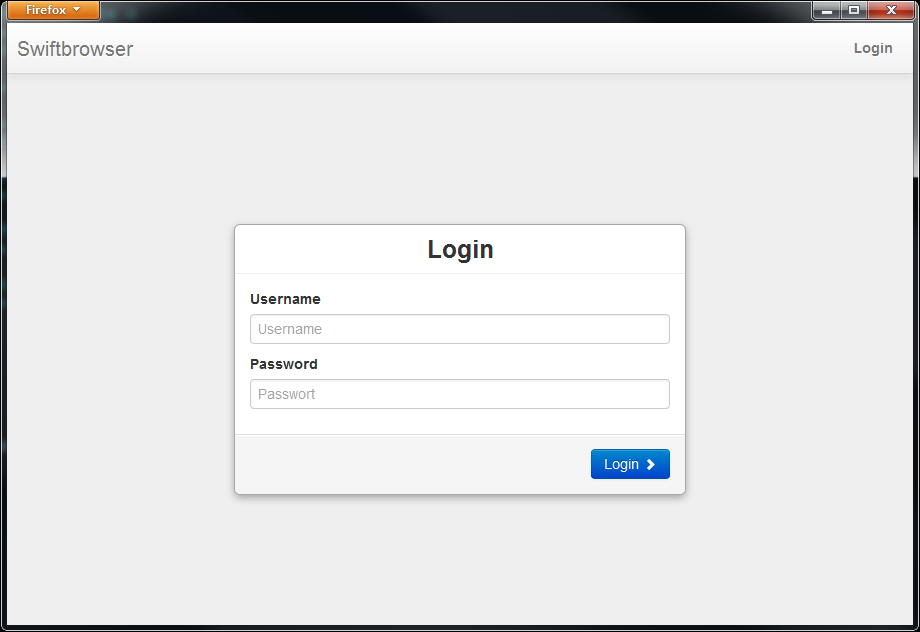
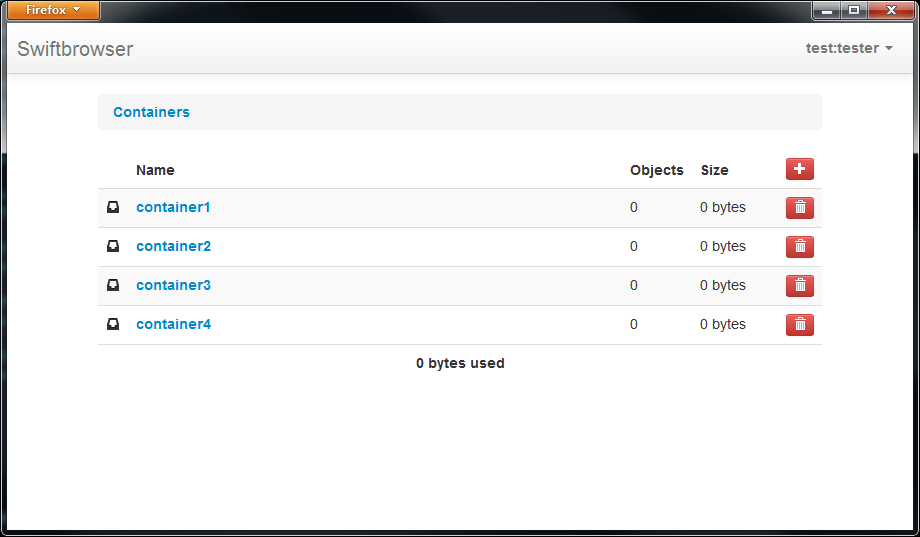
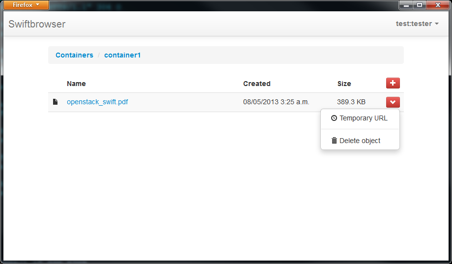

django-swiftbrowser
===================

Simple web app build with Django and Twitter Bootstrap to access Openstack Swift.

* No database needed
* Works with keystone, tempauth & swauth
* Support for public containers. ACL support in the works
* Minimal interface, usable on your desktop as well as on your smartphone
* Screenshots anyone? See below!

Quick Install
-------------

1) Install swiftbrowser:

    git clone git://github.com/cschwede/django-swiftbrowser.git
    cd django-swiftbrowser
    sudo python setup.py install

   Optional: run tests

    python runtests.py

2) Create a new Django project:

    django-admin startproject myproj
    cd myproj
    cp ~/django-swiftbrowser/example/settings.py myproj/settings.py

3) Adopt myproj/settings.py to your needs, especially settings for Swift and static file directories.

4) Update myproj/urls.py and include swiftbrowser.urls:

    import swiftbrowser.urls

    urlpatterns = patterns('',
        url(r'^swift/', include(swiftbrowser.urls)),
    )

5) Collect static files:

    python manage.py collectstatic

6) Run development server:
    
    python manage.py runserver

    Add the option '--insecure' if DEBUG = False and ALLOWED_HOSTS is not changed in myproj/settings.py

7) Deploying to production? Have a look at Djangos docs: https://docs.djangoproject.com/en/1.5/howto/deployment/wsgi/

Screenshots
-----------

